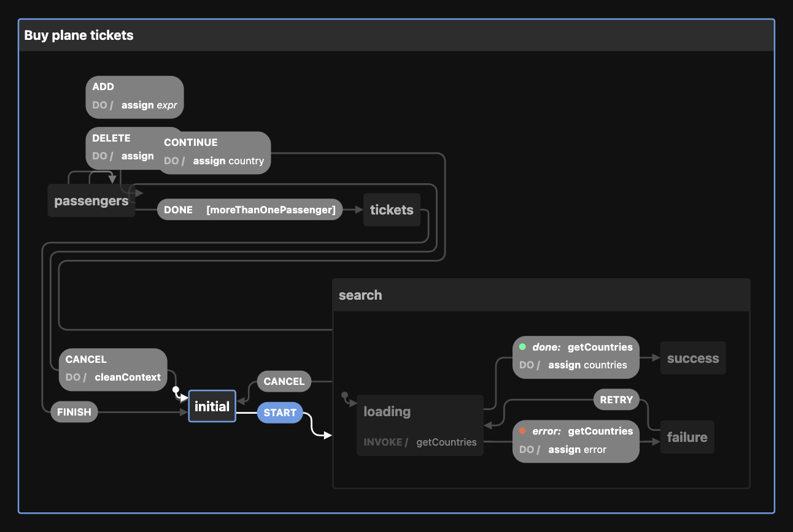

## Xstate Flights
A react app for booking flights using ReactJS and Xstate library. It implements a machine states, with actions and transitions.



### Installation
This app was made with React and Vite, so you can clone the repository and install the dependencies as follow:

```
git clone https://github.com/jsonfm/xstates-flights

npm install
```


### Development
Hot reloading is automatically executed on development.
```
npm run dev
```

### Build
```
npm run build
```

### 📦 Deploy
```
npm run deploy
```